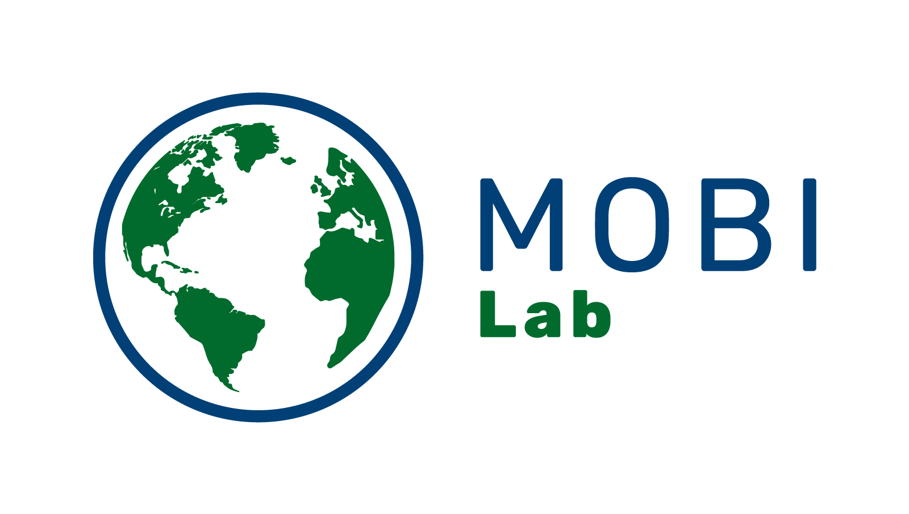
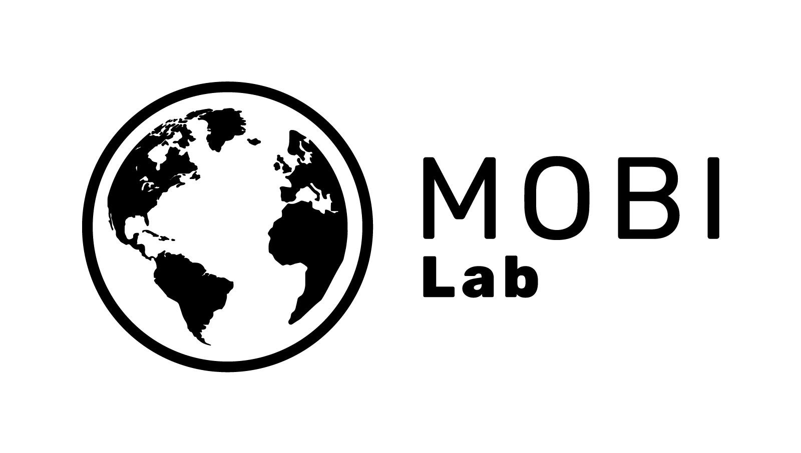
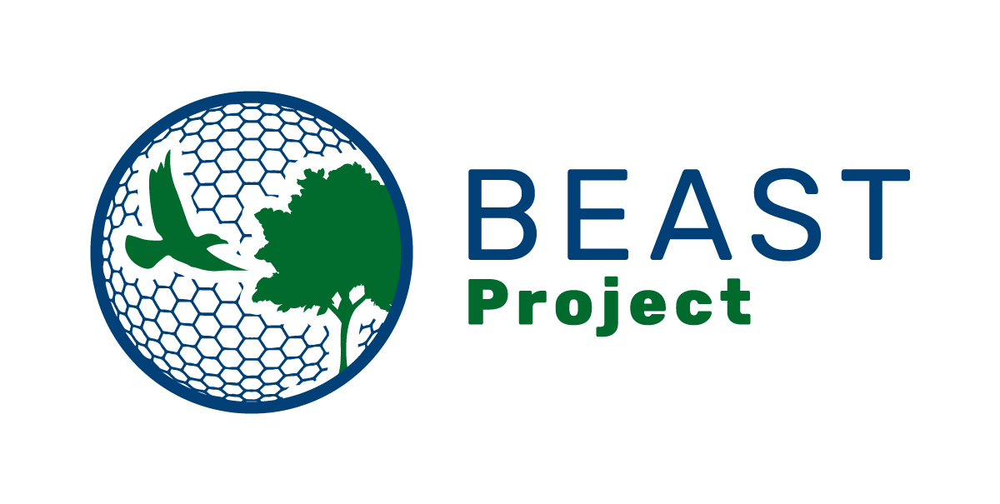
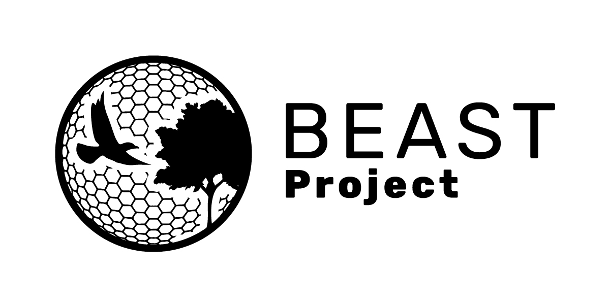
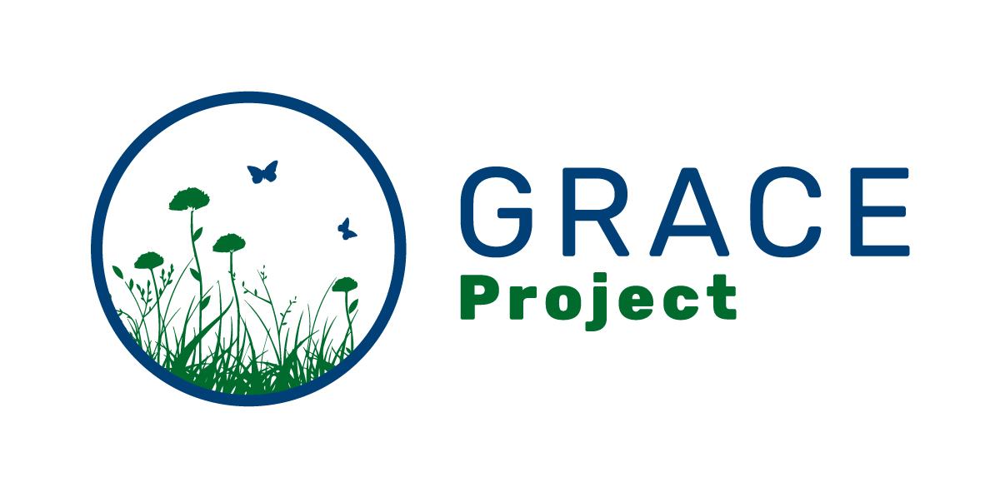
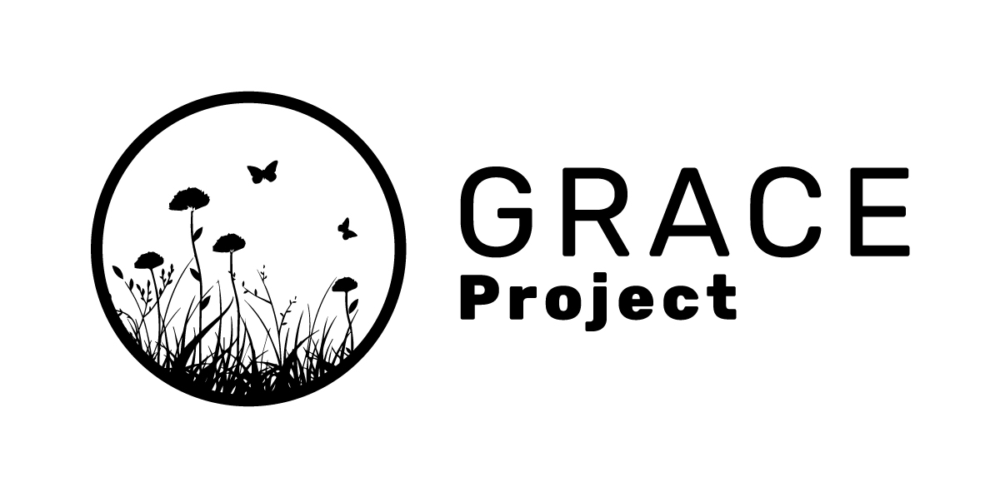

# Repository of graphical material of MOBI lab

The logos of MOBI lab, BEAST project, and GRACE project were created by 
**Adam Vošmera** ([examples of Adam's work](https://www.stovkomat.cz/profil/vosmeraadam)).

The folders in this repo contain **vector and raster versions** (for print and web), 
as well as monochromatic versions with dark and light background.

|Colors| Monochromatic|
|------|--------------|
|||
|||
|||

## If you are paid from the ERC BEAST project

In **all products and public communications** (papers, posters, presentations, articles) acknowledge the funding using the following: *Funded by the European Union (ERC, BEAST, 101044740). Views and opinions expressed are however those of the author(s) only and do not necessarily reflect those of the European Union or the European Research Council Executive Agency. Neither the European Union nor the granting authority can be held responsible for them.*

**Beware:** If you are a co-author, or plan to be a co-author, on a paper that is not open nor publicly freely available, then we may not be able to claim such output for the ERC project. In such case please contact Petr. 

In **presentatinos** and **posters** display the European Union emblem and ERC logo together (applicable to all ERC funded projects). The logos area available in the `ERC_logo` folder above.

